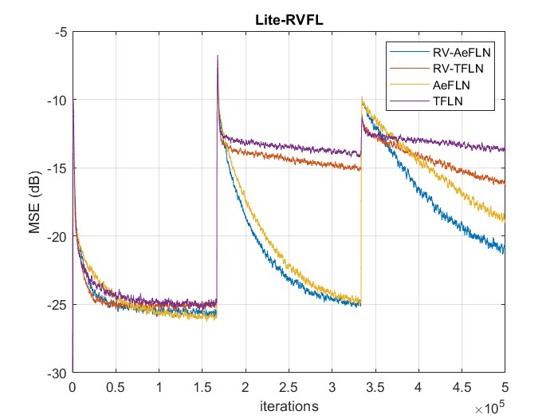

# Lite-RVFL: Adaptive Exponential Functional Link Network for System Identification 


This repository contains MATLAB implementation of **Lite-RVAeFL, RV-TFLN, AeFLN, and TFLN** models for system identification and adaptive filtering.

## Contents
- `Lite_RVFL_system_identification.m` → Main MATLAB code  
- `test_lite.m` → Test script  
- Results → Plots and figures (`.fig`, `.jpg`)  

## Results
Performance comparison (MSE vs iterations):



## How to Run
1. Clone this repository:
   ```bash
   git clone https://github.com/KailashDusad/Lite-RVAeFLN.git
2. Open MATLAB and run:
   ```bash
   Lite_RVFL_system_identification
